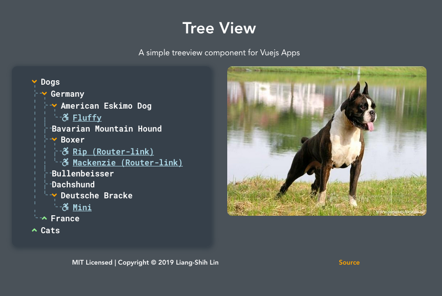

# TreeView for Vue.js

[](https://github.com/ll931217/vue-treeview/stargazers)
[](https://github.com/ll931217/vue-treeview/issues)
[](https://github.com/ll931217/vue-treeview/network)
[](https://nodei.co/npm/@ll931217/vue-treeview/)
[](https://nodei.co/npm/@ll931217/vue-treeview/)
[](https://nodei.co/npm/@ll931217/vue-treeview/)



## Usage

Install the package into your project:

    npm install --save @ll931217/vue-treeview

or

    yarn add @ll931217/vue-treeview

Add this to your `main.js` file:

```javascript
import Vue from 'vue'
import TreeView from '@ll931217/vue-treeview'

Vue.use(TreeView)
```

Then add this to where you want to use the treeview:

```html
<tree-view :tree="tree">
```

The treeview takes in the prop `tree`, which is in the following structure:

```json
[{
  "text": "Dogs",
  "nodes": [{
    "text": "Germany",
    "nodes": [{
      "text": "American Eskimo Dog",
      "nodes": [{
        "text": "Fluffy",
        "link": {
          "type": "link", // Type `link` will create an `Anchor` tag
          "value": "https://upload.wikimedia.org/wikipedia/commons/thumb/f/fe/American_Eskimo_Dog_1.jpg/1920px-American_Eskimo_Dog_1.jpg" // URL of the link
        }
      }]
    }, {
      "text": "Bavarian Mountain Hound"
    }, {
      "text": "Boxer",
      "nodes": [{
        "text": "Rip (Router-link)",
        "link": {
          "type": "router-link", // Type `router-link` will create a router-link, duh.
          "key": "path", // key to use when giving it the value, router-link(:to="{ path: '/d-ger-boxer-rip' }")
          "value": "/d-ger-boxer-rip"
        }
      }, {
        "text": "Mackenzie (Router-link)",
        "link": {
          "type": "router-link",
          "key": "name",
          "value": "d-ger-boxer-machenzie"
        }
      }]
    }, {
      "text": "Bullenbeisser"
    }, {
      "text": "Dachshund"
    }, {
      "text": "Deutsche Bracke",
      "nodes": [{
        "text": "Mini",
        "link": {
          "type": "link",
          "value": "https://animalsbreeds.com/wp-content/uploads/2015/07/Deutsche-Bracke.jpg"
        }
      }]
    }]
  }, {
    "text": "France",
    "nodes": [{
      "text": "Ariegeois"
    }, {
      "text": "Artois Hound"
    }, {
      "text": "Barbet"
    }, {
      "text": "Beagle-Harrier"
    }, {
      "text": "Beauceron"
    }, {
      "text": "Berger Picard"
    }, {
      "text": "Bloodhound"
    }]
  }]
}, {
  "text": "Cats",
  "nodes": [{
    "text": "Russia",
    "nodes": [{
      "text": "Donskoy"
    }, {
      "text": "Kurilian Bobtail"
    }, {
      "text": "Mekong Bobtail"
    }, {
      "text": "Siberian"
    }]
  }, {
    "text": "Thailand",
    "nodes": [{
      "text": "Khao Manee"
    }, {
      "text": "Korat"
    }, {
      "text": "Korn Ja"
    }, {
      "text": "Suphalak",
      "nodes": [{
        "text": "Moon",
        "link": {
          "type": "link",
          "value": "https://www.pets4homes.co.uk/images/articles/4198/what-is-a-suphalak-cat-5947aefcd4845.jpg"
        }
      }]
    }]
  }]
}]

```

## Custom Icons

If you want to use custom icons, you can select them from [FontAwesome 5](https://fontawesome.com/icons?d=gallery), add them like this:

First download their packages (Solid icons are already available):

| Prop      | Type                 | Required |
| --------- | -------------------- | -------- |
| tree      | `Array`              | True     |
| icons     | `String` \| `Object` | False    |

```vue
<template>
  <div id="app">
    <treeview :tree="tree" :icons="icons" />
  </div>
</template>

<script>
import { faChessQueen } from '@fortawesome/free-solid-svg-icons'

import Tree from './tree.json

export default {
  name: 'App',
  data () {
    return {
      tree: Tree,
      icons: {
        closed: 'angle-up',
        opened: 'angle-down',
        default: {
          prefix: 'fab',
          iconName: 'accessible-icon'
        }
      }
    }
  }
}
</script>
```

Adding `.sync` to `:tree` would allow two-way binding for the tree data:

```html
<treeview :tree.sync="tree" />
```

Double-click the parent node will allow you to add new node to the tree, only if `editable` prop is passed with the `boolean` value of `true`:

```html
<treeview :tree.sync="tree" :editable="true" />
```

This can be used for checking user accounts:

```html
<treeview :tree.sync="tree" :editable="userAccount === 'ADMIN'" />
```

## Draggable

```html
<treeview :tree.sync="tree" :editable="true" :draggable="true" />
```

## Upcoming Features

- [ ] Increase further customization with `style` prop

- [x] Change icons
- [x] Add draggable feature
- [x] Add edit button next to nodes
- [x] Add option to create new child node on double click
- [x] Add `router-link` function to layer with `value` key
- [x] Able to change the key and value of the `router-link` object
