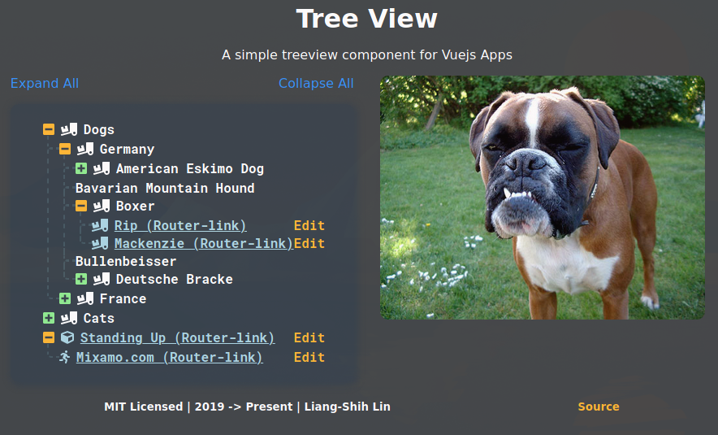

# TreeView for Vue.js

[](https://github.com/ll931217/vue-treeview/stargazers)
[](https://github.com/ll931217/vue-treeview/issues)
[](https://github.com/ll931217/vue-treeview/network)
[](https://nodei.co/npm/@ll931217/vue-treeview/)
[](https://nodei.co/npm/@ll931217/vue-treeview/)
[](https://nodei.co/npm/@ll931217/vue-treeview/)



<a href="https://www.buymeacoffee.com/ll931217" target="_blank"></a>

## :sparkles: Incoming Features

- Bump to vue v3 when ready.
- Add customizable colours for each node, maybe even styles.
- Use `slot` to customize look of node, like icons with images etc. (Will have to look into `slot` a bit more)

*Any future suggestions are welcome*

## :mortar_board: Usage

Install the package into your project:

    npm install --save @ll931217/vue-treeview

or

    yarn add @ll931217/vue-treeview

Add this to your `main.js` file:

```javascript
import Vue from 'vue'
import TreeView from '@ll931217/vue-treeview'

Vue.use(TreeView)
```

Then add this to where you want to use the treeview:

```html
<tree-view :tree="tree">
```

## :evergreen_tree: Tree
The treeview takes in the prop `tree`, which is in the following structure:

```json
[
  {
    "text": "Dogs",
    "nodes": [{
      "text": "Germany",
      "nodes": [{
        "text": "American Eskimo Dog",
        "nodes": [{
          "text": "Fluffy",
          "link": {
            "type": "link", // Type `link` will create an `Anchor` tag
            "value": "https://upload.wikimedia.org/wikipedia/commons/thumb/f/fe/American_Eskimo_Dog_1.jpg/1920px-American_Eskimo_Dog_1.jpg" // URL of the link
          }
        }]
      }, {
        "text": "Bavarian Mountain Hound"
      }, {
        "text": "Boxer",
        "nodes": [{
          "text": "Rip (Router-link)",
          "link": {
            "type": "router-link", // Type `router-link` will create a router-link, duh.
            "key": "path", // key to use when giving it the value, router-link(:to="{ path: '/d-ger-boxer-rip' }")
            "value": "/d-ger-boxer-rip"
          }
        }, {
          "text": "Mackenzie (Router-link)",
          "link": {
            "type": "router-link",
            "key": "name",
            "value": "d-ger-boxer-machenzie"
          }
        }]
      }, {
        "text": "Bullenbeisser"
      }, {
        "text": "Deutsche Bracke",
        "nodes": [{
          "text": "Mini",
          "link": {
            "type": "link",
            "value": "https://animalsbreeds.com/wp-content/uploads/2015/07/Deutsche-Bracke.jpg"
          }
        }]
      }]
    }, {
      "text": "France",
      "nodes": [{
        "text": "Ariegeois"
      }, {
        "text": "Artois Hound"
      }]
    }]
  }, {
    "text": "Cats",
    "nodes": [
      {
        "text": "Russia",
        "nodes": [{
          "text": "Donskoy"
        }, {
          "text": "Kurilian Bobtail"
        }]
      }, {
        "text": "Thailand",
        "nodes": [{
          "text": "Khao Manee"
        }, {
          "text": "Suphalak",
          "nodes": [{
            "text": "Moon",
            "link": {
              "type": "link",
              "value": "https://www.pets4homes.co.uk/images/articles/4198/what-is-a-suphalak-cat-5947aefcd4845.jpg"
            }
          }]
        }]
      }
    ]
  },
  { // >= v0.3.0
    "text": "Standing Up",
    "link": {
      "type": "router-link",
      "key": "path",
      "value": "templink"
    },
    "icon": "cube",
    "nodes": [
      {
        "text": "mixamo.com",
        "link": {
          "type": "router-link",
          "key": "path",
          "value": "templink"
        },
        "icon": "running"
      }
    ]
  }
]

```

## Custom Icons

### Default Icons
If you want to use custom icons, you can select them from [FontAwesome 5](https://fontawesome.com/icons?d=gallery), add them like this:

First download their packages (Solid icons are already available):

| Prop      | Type                 | Required |
| --------- | -------------------- | -------- |
| tree      | `Array`              | True     |
| icons     | `String` \| `Object` | False    |

```vue
<template>
  <div id="app">
    <treeview :tree="tree" :icons="icons" />
  </div>
</template>

<script>
import { faChessQueen } from '@fortawesome/free-solid-svg-icons'

import Tree from './tree.json

export default {
  name: 'App',
  data () {
    return {
      tree: Tree,
      icons: {
        closed: 'angle-up',
        opened: 'angle-down',
        default: faChessQueen
      }
    }
  }
}
</script>
```

### Icon for a node

In your node, add an `icon` object, you can customise the icon for that specific node such as:
```json
{
  "text": "Barbet",
  "icon": "surprise"
}
```

### Toggle whether to show parent node icons

Usage:
```html
<treeview :tree.sync="tree" :editable="true" :show-parent-icon="{ parentShow: true, emptyParentShow: false }" />
```
The above example will show all icons of parent nodes that has children nodes and hide all empty parent nodes.

**NOTE**: the prop `show-parent-icon` can be written as above or `showParentIcon`, its all up to you.

Default:
```javascript
showParentIcon: {
  type: Object,
  default: () => ({
    parentShow: false,
    emptyParentShow: false
  })
}
```

**NOTE**: Parent nodes with `link` property will still show their icon. See the [`JSON` tree](#tree) above, the last object tree, the parent node has `link` property.

## Draggable

```html
<treeview :tree.sync="tree" :editable="true" :draggable="true" />
```

## :100: Tips

Adding `.sync` to `:tree` would allow two-way binding for the tree data, if data changed in the child component it will be updated for the entire tree, this feature is good for if you want to save the tree if it changed:

```html
<treeview :tree.sync="tree" />
```

Double-click the parent node will allow you to add new node to the tree, only if `editable` prop is passed with the `boolean` value of `true`:

```html
<treeview :tree.sync="tree" :editable="true" />
```

This `prop` can be used for checking user accounts:

```html
<treeview :tree.sync="tree" :editable="userAccount === 'ADMIN'" />
```
